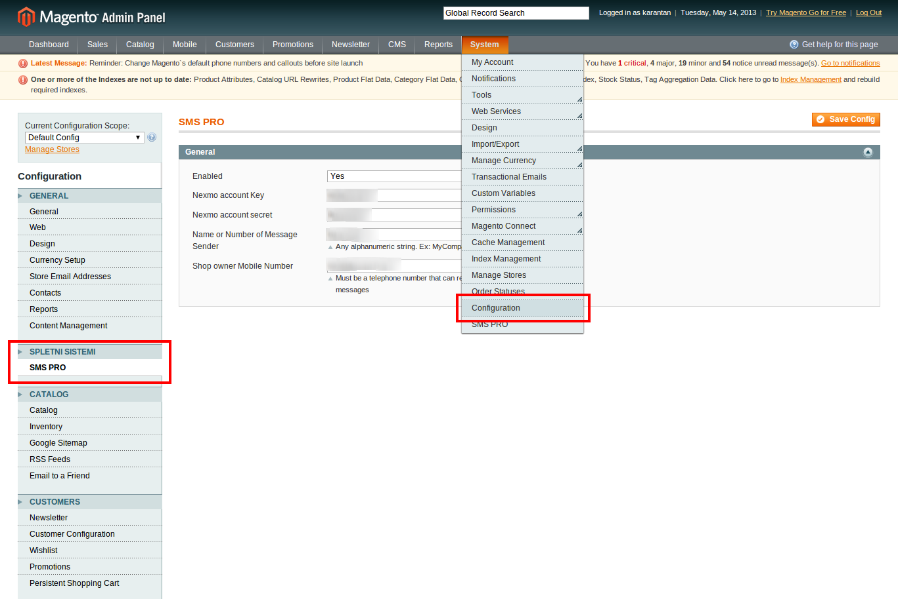
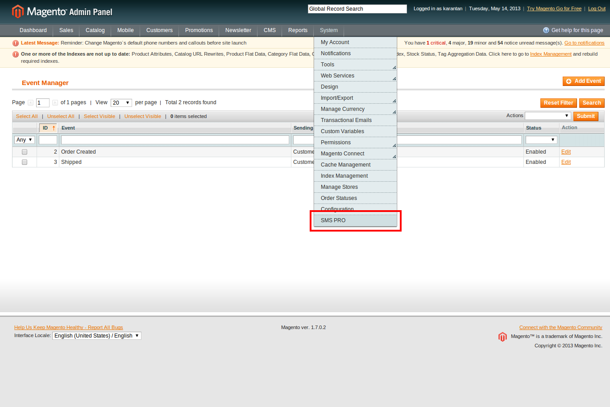
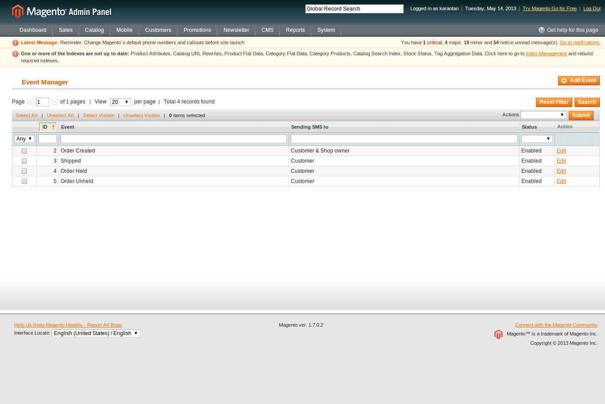
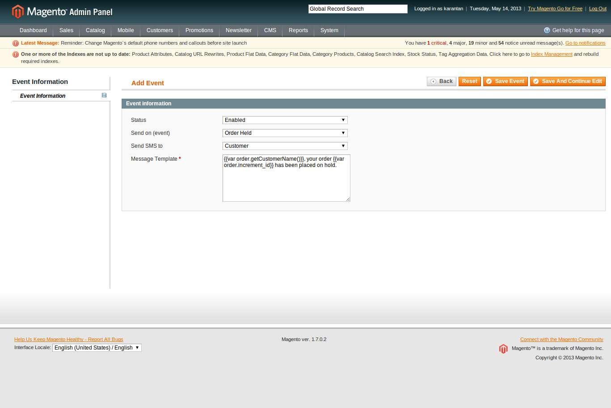
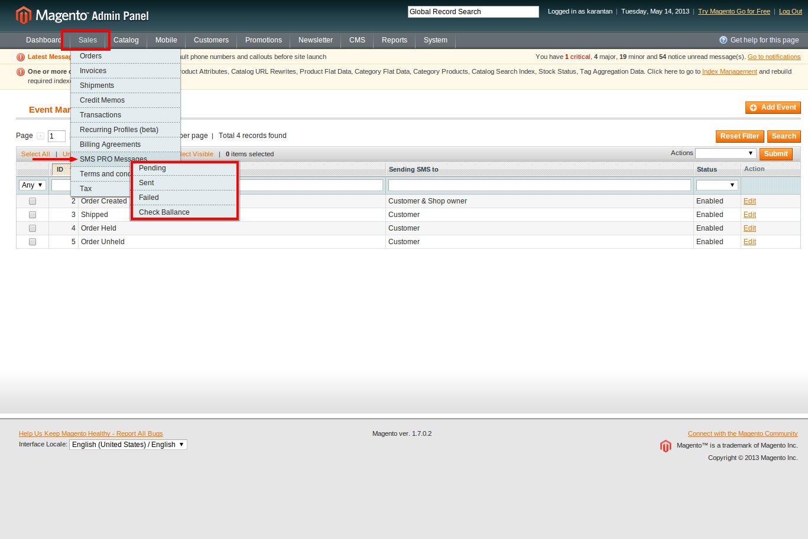
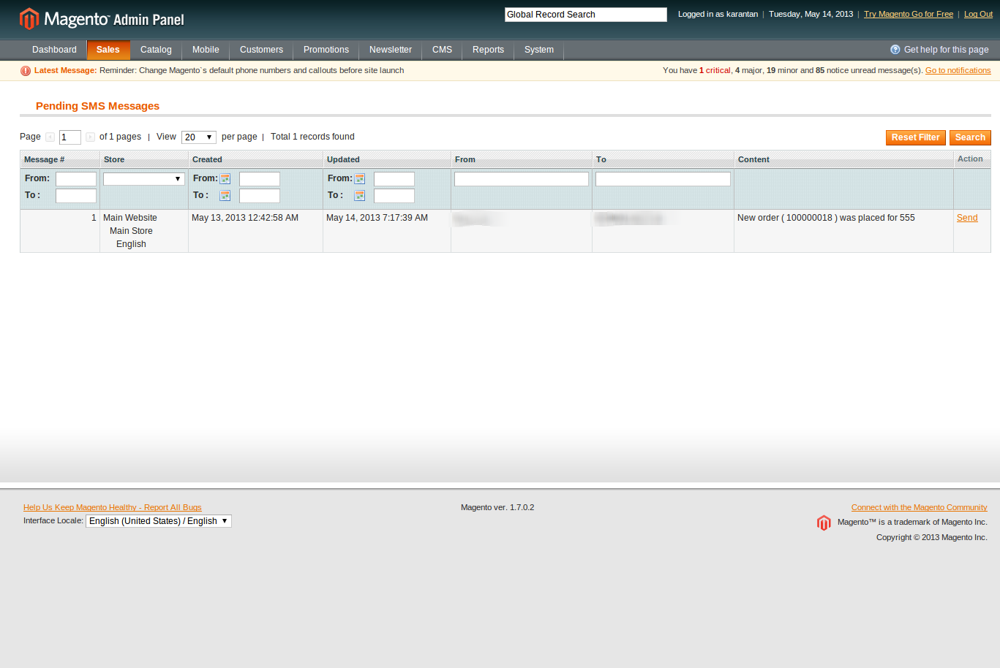
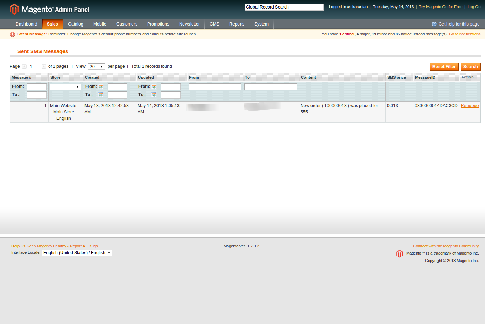
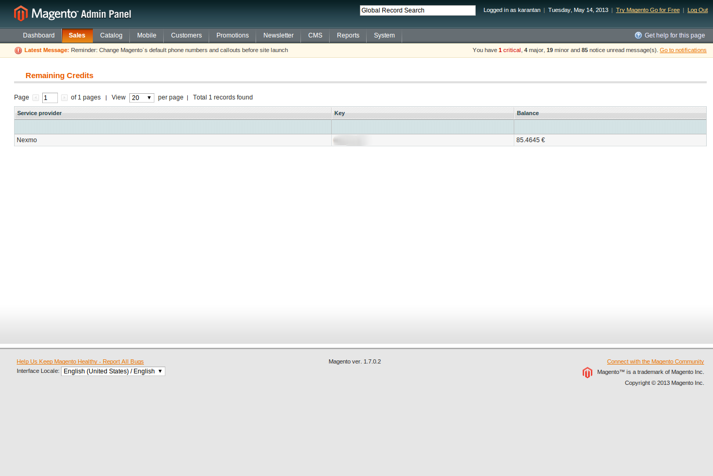

# Installation manual
## Installation
- Copy all files in to the root of your Magento web shop. When asked if you want to overwrite the files, click "Yes to all".
- Go to magento and clear all caches.

## Configuration
Magento SMS PRO is very easy to use. In the
next sections we will show you how configure it
and how to use it.

- First go to SMS PRO configuration page: **System > Configuration > SMS PRO**
- In “General” tab you will have to enter your Nexmo account key and secret. You can find this information in your [Nexmo account](https://dashboard.nexmo.com/login)

_**Note**_
You should also enter your name or number of the SMS sender (e.g. MyCompany) and the number you want to receive SMS messages (shop owner number).

###Events
You can create different events to take effect when customers or system administrator triggers this event.

When you select “Send on (event)” you will see that “Message Template” will
be filled with some predefined data. You can modify this template to your
needs. You will also see that you can select SMS recipient. It can be sent to
customer, shop owner or both. Shop owner number is set in the SMS PRO
configuration page. See the Configuration section for more details.

##Messages
You can see Pending, Sent and Failed SMS messages in **Sales > SMS PRO Messages**

You can also check your Nexmo account balance in the “Check ballance” tab.

